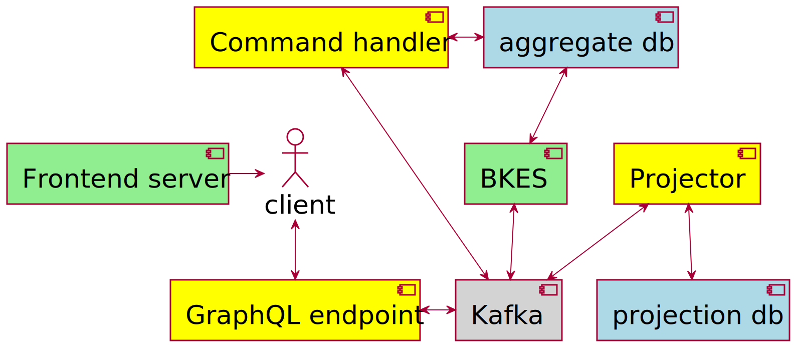

# BOB 2021 - Event in, events out?

Using event sourcing strategies can be a nice way to enable some decoupling. However, when interacting with external systems one should watch out how much of the internal objects leak through to the api.

Event sourcing is an architecture that brings a couple of benefits compared to crud applications. 
It becomes easier to model complex domains, because it can be broken down to smaller pieces.
Because events are the only way to change data, and the events are always stored, there is a clear audit trail.

Using GraphQL for the api enables streaming which is nice when working with events, because they can be shown in the frontend almost directly. 
GraphQL also allows you to design specific types, and even gracefully deprecate when needed.

## Contents

* [Prerequisites](#prerequisites)
* [Intro](#intro)
* [Development](#development)
    * [Building locally](#building-locally)
    * [Building remote](#building-remote)
* [Modules](#modules)
    * [Topology](#topology)
    * [Synchronizer](#synchronizer)
    * [Command handler](#command-handler)
    * [Projector](#projector)
    * [Graphql endpoint](#graphql-endpoint)
    * [Frontend](#frontend)
* [Scripts](#scripts)
* [Warning](WARNING.md)

## <a id="prerequisites">Prerequisites</a>

* [JDK](https://jdk.java.net/) 11 or later, `java -version` to check.
* [Leiningen](https://github.com/technomancy/leiningen/wiki/Packaging) 2, 2.9.5 works, `lein -v` to check
* sassc to compile css, see [lein-sass](https://github.com/tuhlmann/lein-sass#installation) for instructions, 3.6.1 works `sassc -v` to check.
* [Docker](https://www.docker.com/) with docker-compose, doesn't need to be recent, `docker -v` and `docker-compose -v` to check. Docker version 20.10.2 with docker-compose version 1.27.4 works.

## <a id="intro">Intro</a>

This project is an example of an event sourcing application using Kafka.
For the messages it's using the concepts I learned from the [Axon framework](https://docs.axoniq.io/reference-guide/v/3.1/part-i-getting-started/messaging-concepts).
In shore, we have commands, which is the type of message used to change something, what might lead to an event type of message.
An event is something which happened, and we keep forever.
Based on the past events a command can be successful or not.
To ensure CQRS, based on the events we can build projections, on which queries can be executed.
Because we issue the commands and queries over Kafka, the feedback for them is also done via specific messages.

If you don't know much about Kafka, then it's a good idea to
read [an introduction to Kafka](https://hackernoon.com/thorough-introduction-to-apache-kafka-6fbf2989bbc1). 
Another good source are the videos from the 2019 Kafka Summit in San Fransisco, especially
the [keynotes](https://www.confluent.io/resources/kafka-summit-san-francisco-2019/).
For this project we simulate a bank, where an user can log in, and make payments, and there is also an 'employee' mode to check transactions for all accounts.
The commands and events are prepared for multiple accounts per user, but this has not been added to the graphql and frontend layer yet.
The article which served as inspiration for this project
is [real-time alerts](https://www.confluent.io/blog/real-time-financial-alerts-rabobank-apache-kafkas-streams-api/).
There are no alerts in the current project, these could be added, using browser push notifications for example.

As a general rule, it's best to have the same kind of messages on a Kafka cluster.
Data on the brokers is always stored in a binary format, but for clients it's easier to product and consume in something other than binary, therefore there are a lot of (de)serialiser options.
Some of the most common ones are the String(de)serializer and the KafkaAvro(de)serializer.
In this project Strings are used for the keys, and Avro for the values. You can leave the key empty, but when you supply a key, it can be used to divide a topic among partitions. The default way Kafka partitions messages into partitions is using the hash of the key.

For now it's assumed that just one of all the modules run, so the keys aren't really important.
Once one want to scale out, using multiple command-handlers for example, it becomes important the commands for the same aggregate and on the same partition. This will help keeping the system consistent.
Note that the current setup has some [flaws](WARNING.md). Some of these might be solved by using the [Axon framework](https://axoniq.io/product-overview/axon-framework) like in [bank-axon-graphql](https://github.com/gklijs/bank-axon-graphql), I'm not sure how easy it's to use with Clojure however.

The base idea of the project is to serve as an example of event sourcing, where instead of having a 'state' as source of truth we use events. Multiple events around the same entity create an aggregate. This is the derived 'state' against which the commands should be evaluated.

All the used messages are versioned using [Avro](https://avro.apache.org/) and the [Schema Registry](https://docs.confluent.io/current/schema-registry/docs/index.html), which is configured with default settings. This makes sure, when using the Avro (de)serialiser, we can update schema's but only with backwards-compatible ones. The serializer takes care of converting binary data to/from data in specific records.
Since [an enhancement of the Schema Registry](https://www.confluent.io/blog/put-several-event-types-kafka-topic/) it's possible to put multiple types of events in one topic.

Underneath is a complete overview of all the components. Where the grey one is the kafka platform, including ZooKeeper and Schema Registry, the green is Nginx, the blue ones are in memory databases, and the yellow ones are Clojure applications.



## <a id="development">Development</a>

Development is done in Clojure with a lot of java integration. When starting this project there were no great Kafka libraries for Clojure.
Both [jackdaw](https://github.com/FundingCircle/jackdaw) and [noah](https://github.com/blak3mill3r/noah) look promising, and might be a better fit than Java interop, especially when you're not yet familiar with Kafka.

This project is only using the producer and consumer to add or consume data from Kafka.
There are a couple of of different ways to create a consumer, based on whether it should rread from the start and if the messages should all be consumed, or only a part, once multiple instances should be running.
Especially when merging topics it might be easier to use the Kafka Streams api.
With Kafka Streams you can do things like having a time window, or perform joins on topics.
The mentioned libraries also support Kafka Streams. This could be relevant when you have an 'AlertsSettingsUpdated' event which must be combined with a 'MightTriggerAlert' event
Making sure you use the latest settings available when sending alerts.

### <a id="building-locally">Building locally</a>

There are two out-of-the-box ways to run the project, using the confluent cli, or Docker. Using docker is a lot easier because the whole setup is scripted. For both you need the same [Prerequisites](#prerequisites).
When developing on one of the parts, it's possible to stop the docker of that part
and run it locally.
The Docker config has additional listeners to make this easier,
see [kafka-listeners-explained](https://rmoff.net/2018/08/02/kafka-listeners-explained/).
When no environment properties are set, the apps will default to the default ports for Kafka, which are the same as used for setting up the docker environment. So by default it will connect to the Kafka and Schema Registry instance stated by [docker](docker-cluster.yml).

#### Using Clojure and confluent cli

This project uses the sub plugin for Leingen. If you have Leingen installed you need to first 'install' topology by running `lein install` in the topology folder.
If you use [Cursive](https://cursive-ide.com/) you can start each module by going to the main function in `core.clj`, or you can use `lein run` to start.
For development, it can help to mark the [java](topology/target/main/java) folder in `topology/target/main` as generated sources root, so you get some advantages like code completion.
For the Kafka stuff it's handy to use the [confluent cli](https://docs.confluent.io/current/cli/index.html#cli).

With this you can use `confluent local destroy` to stop all the processes and `confluent local services schema-registry start` to start zookeeper, Kafka and the Schema Registry.
Don't forget to run the `synschronize.sh` script each time you start again.
This will use the 'default' ports, which make it possible to run all the modules without having to set environment variables.

#### Using Docker

With the `prepare.sh` script all the uberjars, and a few other files needed for the Docker images are created.
Then with the `restart.sh` script you can use Docker to set it up.
You might also do some steps manually, especially as it takes quit some time to set up everything each time.
You will need about 4Gb of ram for Docker to not run out of memory.

Currently, the script works with a sleep, to prevent unnecessary errors from other containers not being ready yet.
You can ignore the errors about orphan containers apparently this is a side effect of having multiple Docker compose files in the same folder.
The advantage that it's using the same network, so easy to connect to the different components.
Compose file version 2 is used for multiple reasons, it's easy to set a mem limit, and the names of the containers can be set.

For the Kafka images the latest ones from Confluent are used. For the frontend we use Nginx. Most other containers are just jar's that run inside `azul/zulu-openjdk-alpine` to keep the docker image small.
To prevent using too many resources it's using just one Zookeeper and one Broker.
In [kafka-graphql-examples](https://github.com/openweb-nl/kafka-graphql-examples/blob/master/docker-cluster.yml) a cluster is used, and also ssl is enabled for security.
For the Confluent images there are a lot of options that can be set.
Among the other kinds of properties are defaults for creating topics, and configuration for the log cleanup.
The whole list can be found [here](https://kafka.apache.org/documentation/#brokerconfigs).

### <a id="building-remote">Building remote</a>

Make sure you are connected to the correct remote Docker machine. With the build-all.sh script in the root the running containers started with the script will be stopped and deleted.
In three phases the needed containers will be started.
The `.dockerignore` files are set to only expose the files needed which should make it pretty fast, still some of the jar's can be quite big. You might need to configure the advertised listeners differently though.

## <a id="modules">Modules</a>

The modules are described in order of data flow.
The first, topology will be used to generate the data types, the last one, frontend will expose the data to make it visible.

### <a id="topology">Topology</a>

This module generates the java classes needed to use specific Avro schemas. This is usually done using a maven plugin, which generates the classes based on .avsc files as is described in the [avro documentation](https://avro.apache.org/docs/1.10.1/gettingstartedjava.html#Compiling+the+schema).


Generating the classes with the maven plugin can be very tedious since there tend to be a lot of repeated elements in schemas.
By doing some replacements on the structure in the schemas.edn a lot of these are prevented. 
For now, the namespace of the records is always set to `nl.openweb.data`.
This also allows to have a method, which only needs the names, to get the parsed schema from the generated classes.

The module also provides some convenient functions to consume from and produce to Kafka for the use of Kafka with Clojure.

There are also some functions to deal with specific data types like `IBAN` and `UUID`.

Finally, there are functions describing the topics.
The [topology.edn](topology/resources/topology.edn) file in the resource folder gives information about the topics, for example:

```clojure
 "bank_events" [1 3 [:BankAccountCreatedEvent :MoneyCreditedEvent :MoneyDebitedEvent :MoneyReturnedEvent
                     :TransferCompletedEvent :TransferFailedEvent :TransferStartedEvent
                     :UserAddedToBankAccountEvent :UserRemovedFromBankAccountEvent] {:retention.ms -1}]
```

The first part is the actual name of the Kafka topic, and in this particular case also serves as the key as part of a map.
From the vector, which is the value, we can read that it had `1` partitions `3` replicas, is bound to `BankAccountCreatedEvent`, `MoneyCreditedEvent` and other Avro types (which can be found in the [schemas.edn](topology/resources/schemas.edn)), has additional configuration to prevent the events from being deleted from kafka.

To be able to use new schemas, changes are needed the `topology.edn` and `schemas.edn`, a `lein install` of the code needs to be done (maybe with a new version), and the Synchronizer needs to run with the new artifacts.
Clients using the new dependency should then be able to produce/consume the new schema from the configured topics.

### <a id="synchronizer">Synchronizer</a>

This module is used to synchronize an actual cluster with the configuration found in the topology module.
So when a topic does not exist yet, it creates it, and when there is a topic which is not present in the topology it will be deleted.
It will also try to set the schemas for the topics, when there is a schema name provided.
When creating topics it will try to set the replication factor to the requested value, but never higher the amount of brokers available.
When a configuration is provided, it will be used when creating the topics.


There are some limitations in the current implementation:

- When the topic already exist, and also should exist, the configuration of the topic is not checked.
- It's always assuming the 'TopicNameStrategy', see [group by topic or other relationships](https://docs.confluent.io/current/schema-registry/serializer-formatter.html#group-by-topic-or-other-relationships).
- Errors are not handled (e.g. no retry), but the responses from setting the schemas can be read, and the exit status is
  only 0 when there were no errors.

### <a id="command-handler">Command handler</a>

In order to validate the commands the command handler will query the in memory db for existing aggregates.
Each command should either fail or succeed, which results in a message back.
Each successful command also will add an event.
For doing transaction a kind of sub-loop is entered, and it's 'listening' to the result, in order to further process the transaction.
This is kind of following the saga pattern, where for one command you need to coordinate multiple aggregates.
Both the debiting and the crediting part of the transaction may fail, and if the crediting fails while it was debited, the debited money needs to be returned.
It's a simplification of any real transaction as has some special rules.
For example, it's excepting any deposit from 'cash', being handled like a checked cash deposit.
Transfer to any non open iban will be accepted, with the money just being gone. So there will be a `MoneyDebitedEvent` but no `MoneyCreditedEvent`. In a real bank some integration with the other bank is needed.


### <a id="projector">Projector</a>

The projector is the component that makes sure we keep the commands separated from the queries.
It will build a model, a projection, of the current state, based solely on the events that have happened.
Queries from the graphql-endpoint will be handled using this projection.
It has a couple of additional atoms which are not directly just a collection of aggregates te be able to easily handle the queries.
The response to a query can either be a `QueryFailed` with the reason why it failed, or a `QuerySucceeded` where the message will contain the edn representation of the answer.
This closely ties the projector to the graphql-endpoint, as it's expecting the data in a certain format, which is not formalized.
There is a special entity, described in Avro as `TransactionHappenedEvent` which are derived events from parts of a transaction.
These are put into a separate topic, so they can be subscribed to from GraphQL.


### <a id="graphql-endpoint">Graphql endpoint</a>

This graphql endpoint is by example from [lacinia](https://lacinia.readthedocs.io/en/latest/index.html) build using [Stuart Sierra Component Library](https://github.com/stuartsierra/component).
This helps keeping dependencies transparent, and also makes it easier for testing/mocking part of the system.
With [system-viz](https://github.com/walmartlabs/system-viz) we can also easily create an overview of the
system: . To create a new overview use `lein with-profile viz run` in the `graphql-endpoint` folder.

You can use [Graph*i*QL](http://localhost:8888/ide) once the project runs to interact via graphql directly.
As this component is quite complicated there are views of each service separately.
You can see three services in the diagram, and they provide the resolvers that matches to the schema.
They provide the needed logic, using the query bus, or the command bus, or both.
The commands bus is part of the system to deal with commands, sending a command to the right topic, and making sure something is returned in time. This could be a timeout message or the result from the command handler.
The same applies for the query bus, but here, when there is a result, it will convert the string to some clojure structure.


Transaction service is used to either do a query on the current transactions in the db, or start a subscription using a selection of filters to get new transactions when they are consumed.


Account creation can be used to create a account and gives feedback, for example when the password is incorrect.


Money transfer service can be used to transfer money, and gives feedback, for example when the token is wrong.
There are some special conditions for the saga handeling in the command bus, such that from the command bus it will be just a success or failure for a transaction.
Hiding the complexity of the possible multiple events and commands involved.

This endpoint allows querying/streaming `TransactionHappenedEvent` events, creating an account/iban and making a transaction, by a mutation witch will give feedback whether the action succeeded.
It's possible to get a subscription with optional filters.
It's also possible to get all transactions from some iban, or the last transactions.
The endpoint is created using [lacinia](http://lacinia.readthedocs.io/en/latest/overview.html) together with [lacinia-pedestal](http://lacinia-pedestal.readthedocs.io/en/latest/overview.html).

### <a id="frontend">Front-end</a>

This is a basic nginx container which contains the output from the Clojurescript re-frame code. The container is exposed at port 8181.
The location of the GraphQL endpoint is configured in [core.cljs](frontend/src/cljs/nl/openweb/bank/core.cljs) this is configured to use localhost.
Nginx now just serves static files, but could be used to proxy traffic to the graphql endpoint to prevent CORS.
If you run into CORS trouble locally you may need to add the specific port you use when running the front-end to the [server.clj](graphql-endpoint/src/nl/openweb/graphql_endpoint/server.clj) in the endpoint at the `:io.pedestal.http/allowed-origins` key.

## <a id="scripts">Scripts</a>

There are several scripts to automate things. They are placed at the root level.

* `clean.sh` stops and removes all used Docker container, it does not throw away the images
* `prepare.sh` is needed the first time before `restart.sh` can be used. It will get all the dependencies and build jar's. It needs leiningen, maven, sassc to be installed. As last step it will (re)build the docker images.
* `restart.sh` is used to stop and start the whole setup. Once it's finished the application should be accessible at port 8181.
* `synchronize.sh` is used as part of the restart to set both the Kafka topics and schema's in the schema registry.
